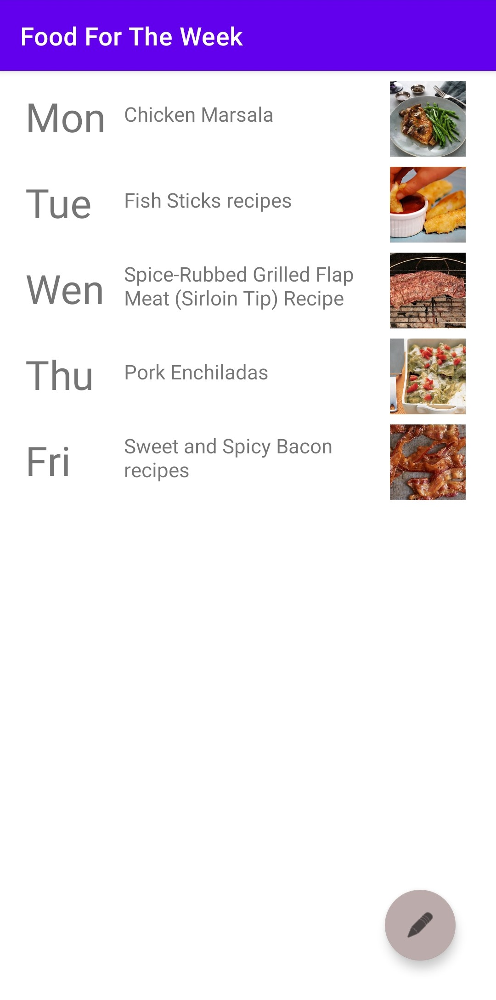

&#xa0;

  <!-- <a href="https://foodfortheweek.netlify.app">Demo</a> -->

<h1 align="center">Food For The Week</h1>

  

  

  

  

<!-- Status -->

<h4 align="center">
	🏫  School 🚀 project...  🚧
</h4>

  <a href="#about">About</a> &#xa0; | &#xa0;
  <a href="#features">Features</a> &#xa0; | &#xa0;
  <a href="#screenshot">Screenshot</a> &#xa0; | &#xa0;
  <a href="#requirements">Requirements</a> &#xa0; | &#xa0;

 

## About

This android app get data from <a href="https://www.edamam.com/">edamam</a> API

## Features

Get random or custom food for every week day. 
You can choose different food for every day. 
A recipe can be found for each dish.

- Mon: Chicken
- Tue: Carrot
- Wen: Chili
- Thu: Tomato
- Fri: Avocado

## Screenshot

## Requirements

Android phone 
&#xa0;

<a href="#top">Back to top</a>
